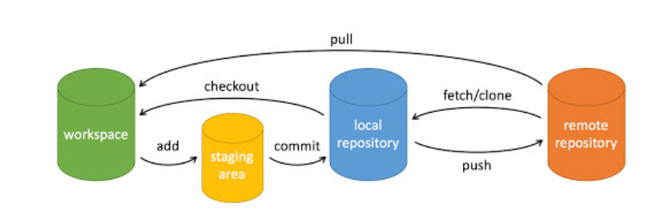

# Git-Command

---
[TOC]


# 一、概念理解


## （一）基础概念

* **workspace**：工作区
* **staging area**：暂存区/缓存区
* **local repository**：本地仓库
* **remote repository**：远程仓库
* **log**：日志
* **init**：初始化
* **branch**：分支
* **config**：配置
* **origin**：源头

## （二）操作理解

* **add**：添加到缓存区
* **commit**：提交到本地仓库
* **push**：推送到远程仓库
* **sync**：同步云端和其他设备文件
* **clone**：从远程仓库克隆到本地
* **checkout**：将本地仓库打开到工作区，或切换分支
* **pull**：从远程仓库拉取到工作区
* **reset**：重新设置版本


## （三）远程分支、当前本地分支

因为我也还不太懂这个，先留着懂了再写

## （四）常用命令

### Git基本语句

**【其实还有个关于GitHub删除文件的操作，有点高端还不会】**
#### 1.git init【初始化本地仓库】

新项目执行Git初始化，并进行第一次提交

```shell
git init 
git add .
git commit -m "first commit"
git remote add origin https://github.com/liyinchigithub/Git-commands.git
git push origin master
```

* 第四个语句应该是建立远程仓库的连接
* 这个master我存疑, 因为GitHub上主分支用的是main

#### 2.git clone【克隆远程仓库】

对github、gitlab远程仓库，已有项目进行克隆

```shell
git clone https://github.com/LeeJc02/Git-command.git
```
* 一般用HTTP/HTTPS协议, 也可以用SSH协议进行下载
#### 3.git pull、git fetch【不太懂】

（1）将远程主机 origin 的 master 分支拉取过来，与本地的 brantest 分支合并。
* 还是那句话, origin的master可能是main, 这有点不太好说

```shell
git pull origin
git pull https://github.com/liyinchigithub/Git-commands.git
```

远程分支是与当前分支合并

* 注意当前分支, 比如vscode默认当前分支用的是master, 有的时候main和master就成了俩分支了

```shell
git pull origin master
```

（2）拉取代码，但不合并到本地【**`fetch`不太会**】


```shell
git fetch --all
git fetch --tags
git reset --hard origin/master
```

（3）git pull 与git fetch区别：【**我还是不太懂, 可以略**】

* 远端跟踪分支不同

git fetch能够直接更改远端跟踪分支。

git pull无法直接对远程跟踪分支操作，我们必须先切回本地分支然后创建一个新的commit提交。

* 拉取不同

git fetch会将数据拉取到本地仓库，它并不会自动合并或修改当前的工作。

git pull是从远程获取最新版本并merge到本地，会自动合并或修改当前的工作。

* commitID不同

使用git fetch更新代码，本地的库中master的commitID不变，还是等于1。

使用git pull更新代码，本地的库中master的commitID发生改变，变成了2。

#### 4.git add【添加到暂存区】

（1）添加指定目录到暂存区，包括子目录：

```shell
git add [dir]
```

例如：添加2个文件到暂存区

```shell
git add README hello.js 
```

（2）添加当前目录下的所有文件到暂存区：

* `.`表示添加到根目录

```shell
git add .
```
#### 5.git rm【文件删除】

如果需要删除的 commit 是一个或多个文件，可以进行以下操作。

（1）被提交到仓库的某个文件需要删除，可以使用 git rm 命令：

```shell
git rm <file> // 从工作区和暂存区删除某个文件

git commit -m "" // 再次提交到仓库
```

（2）如果只想从暂存区删除文件，本地工作区不做出改变，可以：

```shell
git rm --cached <file>
```

* `cached`表示缓存区

（3）如果在工作区不小心删错了某个文件，可以用 git checkout 将暂存区的文件覆盖工作区的文件，从而把误删的文件恢复：

```shell
git checkout -- <file>
```

（4）**用 git rm 删除文件，同时还会将这个删除操作记录下来**

用 rm 删除文件，删除的仅仅是本地物理文件，没有将其从 git 的记录中剔除。

（5）git add 和 git rm 区别，

git add 仅能记录添加、改动的动作，删除的动作需靠 git rm 来完成。

#### 6.git commit【提交到本地仓库，-m表所有】

将暂存区内容添加到本地仓库中

```shell
git add .
git commit -m "提交内容备注"

```

* 在执行`git add .`  之后执行`git commit``

* `-m` 表示将暂存区所有都进行提交


#### 7.git log【查看提交日志】

（1）查看提交历史(其实我是想把它放在高端操作里的)


（2）用 `--oneline` 选项来查看历史记录的**简洁的版本**

```shell
git log --oneline
```

（3）可以用 `--graph` 选项，查看历史中什么时候出现了**分支、合并**。


（4）可以用 `--reverse` 参数来逆向显示所有日志。

```shell
git log --reverse --oneline
```

 （5）如果只想查找指定用户的提交日志

```shell
git log --author
```

 例如，比方说我们要找 Git 源码中 Linus 提交的部分

```shell
git log --author=Linus --oneline -5

```

 （6）如果你要指定日期，可以执行几个选项：--since 和 --before，但是你也可以用 --until 和 --after。(又开始不太懂)

```shell
git log --oneline --before={3.weeks.ago} --after={2020-04-23} --no-merges
```

 （7）git blame

* 和上面的简介版本不同,这个命令似乎是细节满满,列出了每条是哪个大神所写的详细信息

```shell
git blame <file>

```
#### 8.git reset【从本地仓库回滚代码】

（1）回滚代码，撤销某一次commit，并**强推到远程仓库**

* 有一说一,我觉得这个回滚蛮重要的

如果需要删除的 commit 是最新的，那么可以通过 git reset 命令将代码回滚到之前某次提交的状态，但一定要将现有的代码做好备份，否则回滚之后这些变动都会消失。具体操作如下：

```shell
git log // 查询要回滚的 commit_id

git reset --hard commit_id // HEAD 就会指向此次的提交记录

git push origin HEAD --force // 强制推送到远端
```

（2）回退所有内容到上一个版本

```shell
git reset HEAD^
```

（3）回退 某个文件的版本到上一个版本

```shell
git reset HEAD^ hello.js
```

执行 git reset HEAD 命令用于**取消已缓存的内容**。

执行 git reset HEAD 以取消之前 git add 添加，但不希望包含在下一提交快照中的缓存 。

（4）回退到指定版本

查看提交日志，回退到指定`commit_id`


```shell
git log
git reset --hard commit_id
```

 或者

```shell
git reset 052e
```

（5）回退上上上一个版本

```shell
git reset --soft HEAD~3
```

备注：此次提交之后的修改会被退回到暂存区

（6）回退到某个版本**回退点之前**的所有信息。

* 回退的回退,有点麻了

```shell
git reset –hard bae128
```

备注：**此次提交之后的修改不做任何保留**，`git status` 查看工作区是没有记录的。

（7）将本地的状态回退到和远程的一样, 恢复远程段数据

```shell
git reset --hard origin/master
```

注意：谨慎使用` –hard `参数，它会**删除回退点之前的所有信息**。

（8）HEAD 说明：


可以使用 ～数字表示


（9）误删恢复

如果回滚代码之后发现复制错了 `commit_id`，或者误删了某次 commit 记录，也可以通过下方代码恢复：

```shell
git relog // 复制要恢复操作的前面的 hash 值

git reset --hard hash // 将 hash 换成要恢复的历史记录的 hash 值
```

注意：删除中间某次提交时最好不要用 git reset 回退远程库，因为之后其他人提交代码时用 git pull 也会把自己的本地仓库回退到之前的版本，容易出现差错进而增加不必要的工作量。

* 省流: 回退远程库会让人家同时进行的恢复远程库时倒大霉

#### 9.git branch【分支相关操作】

* 分支操作都不太懂, 看看差不多得了, 反正也没咋用到过(小白发言)
* 另外分支操作, 一定小心master和main的统一性

（1）新建分支

```shell
git branch 新建的分支名
```

 （2）查看所有分支信息

```shell
git branch
```

（3） 删除分支

```shell
git branch master
git branch -d 分支名称
```

**删除分支前，需要切换到其他分支**


 ①删除本地分支

```shell
git branch
git checkout master
git branch -d 本地分支名
```

②删除远程分支

```shell
git push origin --delete 远程分支名称
```

如何本地分支已提交到远程仓库，想删除这个分支，除了删除本地分支，还需要远程分支也要删除，以上两个命令都要执行一次。

#### 10.git status【查看状态, 感觉也用的不多】

查看当前分支状态

```shell
$ git status
On branch master

Initial commit

Changes to be committed:
  (use "git rm --cached <file>..." to unstage)

    new file:   README
    new file:   hello.php
```

#### 11.git checkout【切换分支】

切换分支,跟上述`git branch`相关分支操作连用较多


#### 12.git push【推送操作】

（1）将本地的 master 分支推送到 origin 主机的 master 分支。

* main啊!main啊!!强调很多遍了

```shell
git push origin master
```

（2）本地版本与远程版本有差异，但又要强制推送可以使用 --force 参数：

```shell
git push --force origin master
```

（3）指定分支(跟个公式一样)

```shell
git push <远程主机名> <本地分支名>:<远程分支名>
```

 完整操作

```shell
git branch
git checkout 分支名
修改代码
git add .
git commit -m "提交内容注释"
git push origin master
```

* 查看分支
* 切换分支
* 分支添加到暂存区
* 暂存区提交到本地库
* 推送远程库

远程项目仓库对提交上来的分支代码还有做merge操作，才可以把分支代码合并到master中
(那么问题来了,merge又是个啥呢?)


#### 13.git revert【撤销某次提交】


`git revert` 之前的提交仍会保留在 `git log` 中，而此次撤销会做为一次新的提交。

`git revert -m`：用于对 `merge` 节点的操作，`-m `指定具体某个提交点。

（1）撤销提交

要撤销中间某次提交时，使用 git revert 也是一个很好的选择：

```shell
git log // 查找需要撤销的 commit_id

git revert commit_id  // 撤销这次提交
```

（2）撤销 merge 节点提交

如果这次提交是` merge `节点的话，则需要加上 `-m `指令：

```shell
git revert commit_id -m 1 // 第一个提交点

// 手动解决冲突

git add -A

git commit -m ""

git revert commit_id -m 2 // 第二个提交点

// 重复 2，3，4

git push
```


#### 14.git remote【远程操作】


远程仓库操作

```shell
git remote show [remote]
git remote show https://github.com/liyinchigithub/Git-commands
```

（1）添加远程版本库

一般在新建项目时使用

```shell
git init
git add .
git commit -m "first commit"
git remote add origin https://github.com/liyinchigithub/Git-commands.git
git push -u origin master
```

（2）删除远程仓库

```shell
git remote rm name
```

（3）修改仓库名

```shell
git remote rename old_name new_name 
```

* 有些remote参数我也没看明白,建议边用边查
* 理论上来讲也可以用remote命令进行远程库的文件管理

#### 15.git config【配置命令，可进阶】

（1）显示当前的 git 配置信息

```shell
git config --list
credential.helper=osxkeychain
core.repositoryformatversion=0
core.filemode=true
core.bare=false
core.logallrefupdates=true
core.ignorecase=true
core.precomposeunicode=true
```

（2）编辑当前的 git 配置信息

```shell
git config -e
```
---
* 包括如果push不了, 就需要config语句把默认的HTTP/HTTPS通道换成更安全的SSH通道


### Git进阶语句

下列语句不再赘述(~~其实是因为我也不会~~),用的较少,建议边查边用,完结撒花!!

#### 1.git tag【打标签】

（1）打标签

到一个重要的阶段，并希望永远记住那个特别的提交快照，你可以使用 git tag 给它打上标签

```shell
git tag -a v1.0 -m "release 1.0 version" 
git push origin :v1.0
```


（2）查看本地标签

```shell
git tag
```

（3）查看远程所有 tag

```shell
git ls-remote --tags origin
```

（4）将本地tag推送到远程

```shell
git push origin v1.0
```


也可以仅执行该句，会自动生成本地tag并推送到远程


（5）完整的标签操作

```shell
git add .
git commit -m "first commit"
git push origin master
git push origin v1.0

```

或者

```shell
git add .
git commit -m "first commit"
git push origin master
git tag -a v1.1 -m "release 1.0 version"
git tag
git push origin :v1.1
```

（6）删除本地tag

```shell
git tag -d v1.0
```


（7）删除远程tag

```shell
git push origin :refs/tags/v1.0
```

（8）追加标签

如果我们忘了给某个提交打标签，又将它发布了，我们可以给它追加标签。

```shell
$ git tag -a v0.9 85fc7e7
$ git log --oneline --decorate --graph
*   d5e9fc2 (HEAD -> master) Merge branch 'change_site'
|\  
| * 7774248 (change_site) changed the runoob.php
* | c68142b 修改代码
|/  
* c1501a2 removed test.txt、add runoob.php
* 3e92c19 add test.txt
* 3b58100 (tag: v0.9) 第一次版本提交
*
```

（3）查看标签

```shell
git tag
```

#### 2.git merge【合并分支】


（1）开发分支（dev）上的代码达到上线的标准后，要合并到 master 分支

```shell
git checkout dev
git pull
git checkout master
git merge dev
git push -u origin master
```

（2）当master代码改动了，需要更新开发分支（dev）上的代码

```shell
git checkout master 
git pull 
git checkout dev
git merge master 
git push -u origin dev
```

#### 3.git rebase【重定基底】

当两个分支不在一条线上，需要执行 merge 操作时使用该命令。

（1）撤销提交

如果中间的某次 commit 需要删除，可以通过 git rebase 命令实现，方法如下：

```shell
git log // 查找要删除的前一次提交的 commit_id

git rebase -i commit_id // 将 commit_id 替换成复制的值

进入 Vim 编辑模式，将要删除的 commit 前面的 `pick` 改成 `drop`

保存并退出 Vim
```

（2）解决冲突

该命令执行时极有可能出现 reabase 冲突，可以通过以下方法解决：

```shell
git diff // 查看冲突内容

// 手动解决冲突（冲突位置已在文件中标明）

git add <file> 或 git add -A // 添加

git rebase --continue // 继续 rebase

// 若还在 rebase 状态，则重复 2、3、4，直至 rebase 完成出现 applying 字样

git push
```